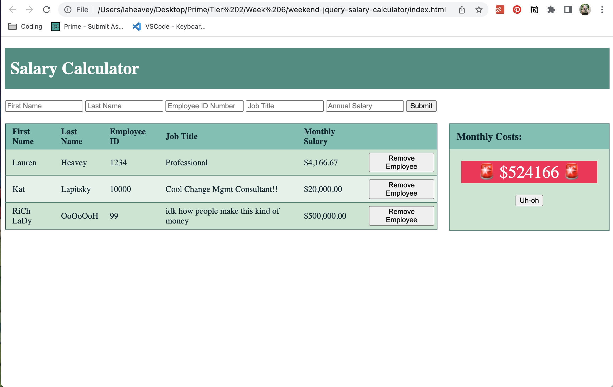

# jQuery Salary Calculator

## Description

_Duration: Two Days_

This salary calculator allows the user to input employee information and determine total monthly expenses. On submit, information is stored to calculate monthly costs, and then appended to the DOM. 

Based on monthly cost valuation, elements of the calculator will change, appear, and disappear. If monthly costs exceed $20,000, a red background is added; if monthly costs exceed $500,000, I have added additional logic to declare bankruptcy.

## Screen Shot

<!--  -->

## Built With

- Javascript
- HTML
- CSS 
- my blood, sweat, & tears

## Acknowledgement
Thanks to [Prime Digital Academy](www.primeacademy.io) who continue to teach me a staggering amount of info daily! 
